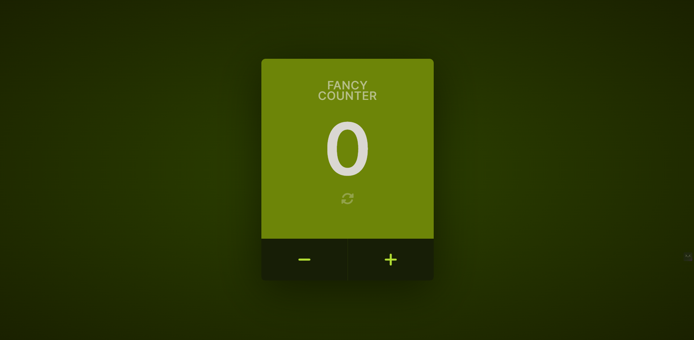

# ByteGrad JS Course - Fancy Counter

This is a solution to the [Fancy Counter](https://main--kt-fancy-counter.netlify.app/).

## Table of contents

- [Overview](#overview)
  - [Screenshot](#screenshot)
  - [Links](#links)
- [My process](#my-process)
  - [Built with](#built-with)
  - [What I learned](#what-i-learned)
  - [Continued development](#continued-development)
  - [Useful resources](#useful-resources)

## Overview

### Screenshot

### Links

- Solution URL: [Github repo link](https://github.com/blanKTcup/Fancy-Counter)
- Live Site URL: [Live site link](https://main--kt-fancy-counter.netlify.app/)

## My process

### Built with

- Semantic HTML5 markup
- CSS Flexbox
- SASS/SCSS
- JS

### What I learned

In this project, I continued to learn a lot more about using npm scripts for sass. I managed to formulate my own json file that fully builds html, sass, and js smoothly. This project was meant to build upon my JS knowledge and it certainly did. I learned more about event listeners because I wanted to implement extra keyboard functionalities for the counter that were not taught in the course.

### Continued development

Still want to keep learning more about JS, best practices, how to be more efficient, less repetition, etc.

### Useful resources

- [ByteGrad JS Course](https://bytegrad.com/courses/professional-javascript) - This is the link to ByteGrad's JS course

